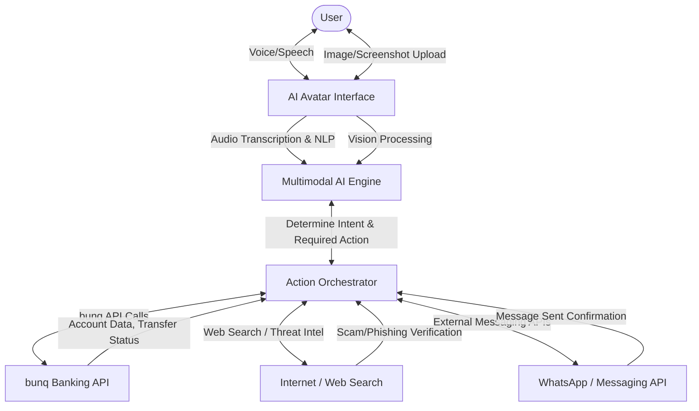
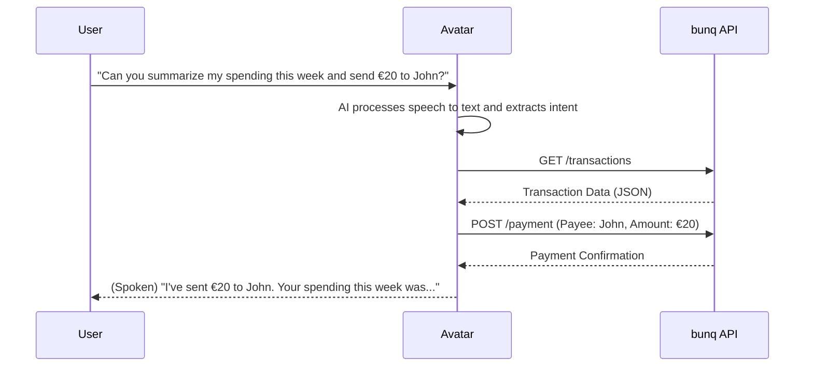
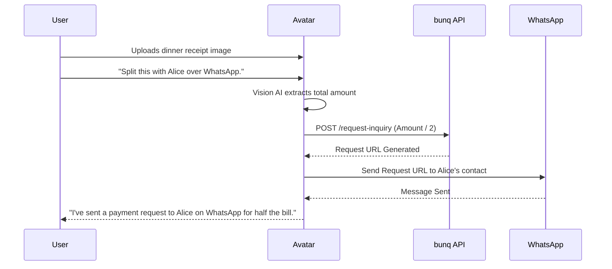
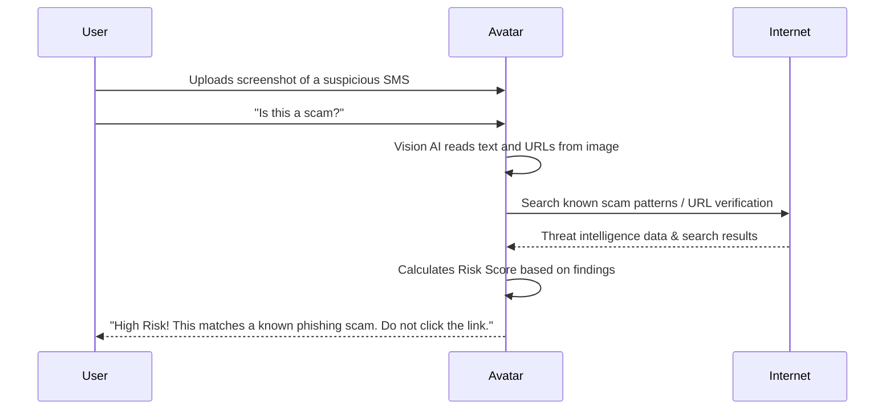

# GuardianAI: AI Avatar Banking Companion

Built for the [bunq Hackathon](https://www.bunq.com/en-nl/hackathon).

## The Problem
Many users, particularly the elderly or young adults, feel anxious when using traditional banking apps. Complex interfaces, confusing financial jargon, and the fear of making a costly mistake lead to "money tension." When scams happen, users might be rushed or under intense social engineering pressure, making it incredibly difficult to navigate standard banking menus to freeze a card or report an incident. Traditional banking apps require users to conform to rigid UI structures, which can be inaccessible during times of panic or for those who are simply less tech-savvy.

## Our Solution
We built an **AI avatar-led banking platform** named GuardianAI. Instead of navigating complex menus, tabs, and settings, the user simply talks to a human-like AI avatar. The AI acts as the sole interface, taking actions on behalf of the user directly through the bunq API. 

This human-like experience mitigates user error, provides profound peace of mind, and empowers less tech-savvy users to manage their finances confidently. By introducing a natural, conversational layer on top of a powerful banking infrastructure, we are transforming the banking experience from a self-serve chore into a guided, supportive service.

---

## Feature Roadmap

Our vision for GuardianAI extends beyond a simple hackathon prototype. We have divided our feature set into what we have currently built and our ideal vision for a fully integrated bunq app.

### Current Features (Hackathon Prototype)
Our current web application successfully demonstrates the core mechanics of an AI-led banking experience:
- **Speech-to-Speech Interaction**: Natural, low-latency conversational banking. You speak to the avatar, and it speaks back, eliminating the need to type out commands.
- **Fraud Detection via Image Scanning & Web Search**: Upload screenshots of suspicious transaction requests, text messages, or website links. The AI analyzes the image, performs web searches against known scam databases, and returns a real-time risk score.
- **Fetch Details from Bank Account**: Ask the avatar for your balance, recent transactions, or spending summaries. The AI securely fetches and reads out this information from your bunq account.
- **Send Messages via External Apps**: The avatar can draft and send payment links or split requests directly through external messaging platforms like WhatsApp.
- **Voice Transactions**: Authorize and execute money transfers entirely through voice commands.
- **Bill Splitting & WhatsApp Transaction Requests**: Upload an image of a receipt. The AI extracts the total, calculates the split, and automatically generates transaction requests to send to friends via WhatsApp.

### Ideal Features (Full bunq Integration)
In the ideal future state, GuardianAI becomes the ultimate, hands-off banking companion natively within bunq:
- **Create & Delete bunq Accounts**: Complete onboarding and offboarding entirely through natural conversation with the avatar. No forms to fill out manually.
- **End-to-End Avatar Control**: Absolute hands-off usage. Every single feature of the bunq app (ordering physical cards, changing PINs, setting up savings goals) can be controlled via voice and avatar.
- **Memory & Personalization**: The AI remembers past interactions, frequent payees, and user preferences. For example: "Pay my usual rent to John" or "Set aside my standard monthly savings."
- **Proactive Background Account Activity**: The AI continuously monitors your account in the background. It will proactively alert you to unusual spending patterns, upcoming large bills, or duplicate subscription charges without you needing to ask.

---

## Deep Dive: How It Works

We built a web application that deeply integrates with the [bunq API](https://doc.bunq.com/). The AI Avatar orchestrates the entire experience, from understanding user intent to executing secure API calls. The core philosophy is **Intent-Driven Actions**: the user provides the intent ("I want to pay John"), and the AI handles the complex execution steps.

### 1. The Multimodal Engine
At the heart of GuardianAI is a multimodal Large Language Model (LLM). This engine is responsible for:
- **Audio Processing**: Converting user speech to text and analyzing tone.
- **Vision Processing**: Reading receipts, parsing screenshots of text messages, and identifying suspicious URLs.
- **Reasoning**: Deciding which tool or API endpoint to call based on the user's intent.

### 2. The Action Orchestrator
When the LLM decides an action is needed, it passes a structured command to the Action Orchestrator. This backend component safely wraps the bunq API. For example, if the user asks to send money, the orchestrator:
1. Verifies the user's authentication token.
2. Translates the LLM's requested amount and payee into a strict bunq API payload.
3. Executes the POST request to the bunq API.
4. Returns the success/failure status back to the LLM to inform the user.

### 3. External Intelligence
For fraud detection, GuardianAI doesn't just rely on its internal training. It actively reaches out to the internet to verify claims. If a user uploads a screenshot of a "bunq security alert" text message, the AI extracts the phone number and URL, cross-references it with live web searches for known phishing campaigns, and calculates a risk score before advising the user.

### System Architecture

### Action Flows

#### 1. Voice Transaction & Summary

#### 2. Receipt Scanning & WhatsApp Bill Splitting

#### 3. Fraud Detection via Screenshot

---

## Pitch Details

- **Creativity & Innovation**: Highly future-proof. By removing traditional UI navigation in favor of a conversational avatar, we are rethinking the fundamental way humans interact with their banks. It shifts the paradigm from "user-operated" to "AI-assisted."
- **Impact & Usefulness**: High impact. It dramatically increases accessibility and ease-of-use for everyone, especially those who find banking apps stressful or confusing. The hands-free nature also aids visually impaired or motor-impaired users.
- **Technical Execution**: A fully functional web application built on top of the bunq API, utilizing cutting-edge multimodal AI to process voice, text, and images seamlessly. It bridges complex backend API orchestration with a simple, human-like frontend.
- **bunq Integration**: Runs entirely on top of the bunq platform, leveraging their robust API for accounts, payments, and requests. It demonstrates how bunq's infrastructure can support next-generation, AI-first user experiences.

---

## Resources
- [bunq Hackathon](https://www.bunq.com/en-nl/hackathon)
- [bunq API Documentation](https://doc.bunq.com/)
