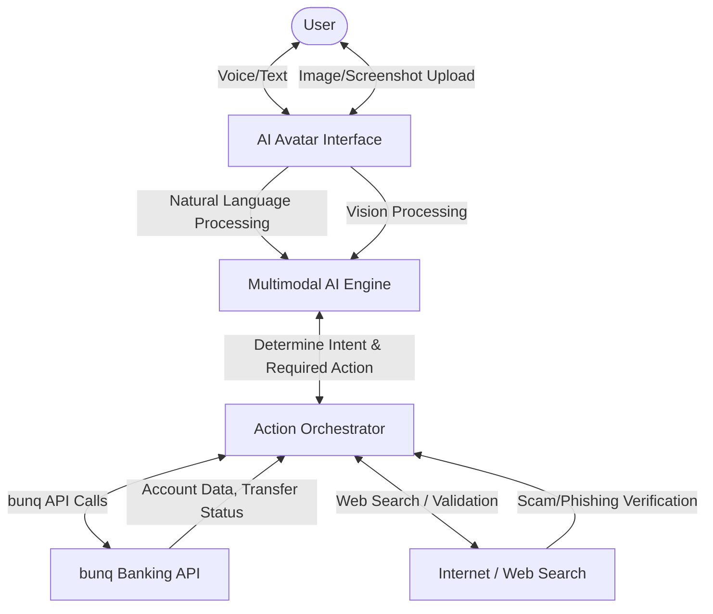
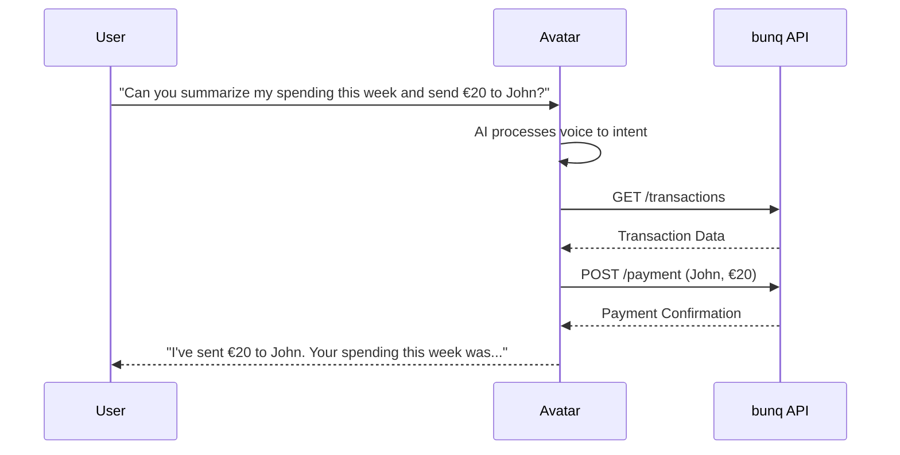
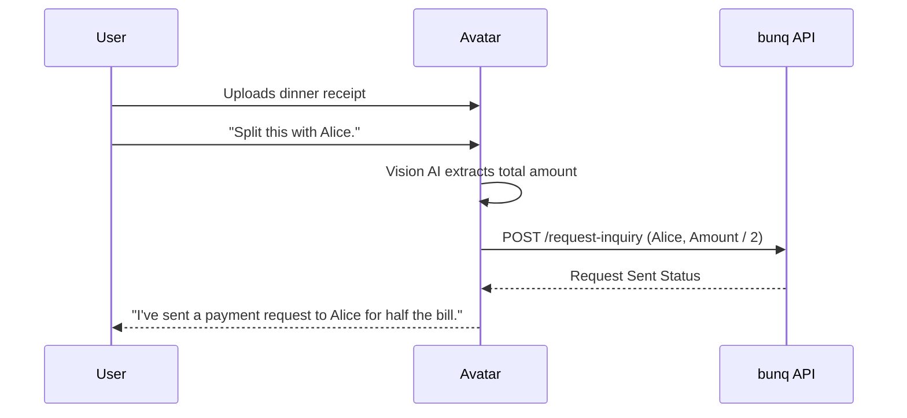
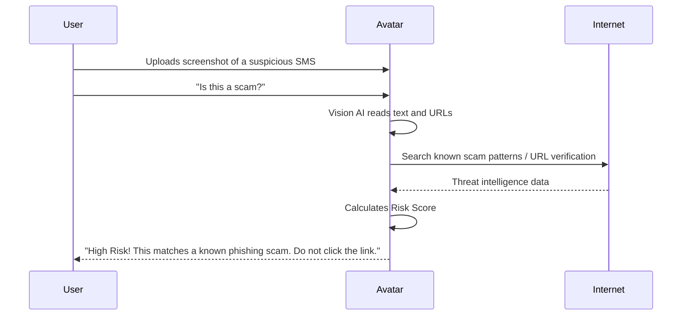

# AI Avatar Banking Companion

Built for the [bunq Hackathon](https://www.bunq.com/en-nl/hackathon).

## The Problem
Many users, particularly the elderly or young adults, feel anxious when using traditional banking apps. Complex interfaces and the fear of making a costly mistake lead to "money tension." When scams happen, users might be rushed or under social engineering pressure, making it difficult to navigate standard banking menus.

## Our Solution
We built an **AI avatar-led banking platform**. Instead of navigating complex menus, the user simply talks to a human-like AI avatar. The AI acts as the sole interface, taking actions on behalf of the user directly through the bunq API. 

This human-like experience mitigates user error, provides peace of mind, and empowers less tech-savvy users to manage their finances confidently.

---

## Key Features

- **Voice-Driven Banking**: Sort money, send transactions, and generate account summaries simply by talking to the avatar.
- **Smart Receipt & Screenshot Scanning**: Upload images of receipts or screenshots to detect expenditures automatically.
- **Automated Bill Splitting**: Ask the avatar to split a scanned bill, and it will automatically send payment requests to your friends or other users.
- **Real-Time Fraud Detection**: Upload screenshots of suspicious transaction requests, text messages, or website links. The AI analyzes the content and assigns a **Risk Score** to help you determine if it is legitimate.
- **Multimodal AI**: Seamlessly blends voice, text, and image understanding to handle complex financial tasks.

---

## How It Works

We built a web application that deeply integrates with the [bunq API](https://doc.bunq.com/). The AI Avatar orchestrates the entire experience, from understanding user intent to executing secure API calls.

### System Architecture

### Action Flows

#### 1. Voice Transaction & Summary

#### 2. Receipt Scanning & Bill Splitting

#### 3. Fraud Detection via Screenshot

---

## Pitch Details

- **Creativity & Innovation**: Highly future-proof. By removing traditional UI navigation in favor of a conversational avatar, we are rethinking the fundamental way humans interact with their banks.
- **Impact & Usefulness**: High impact. It dramatically increases accessibility and ease-of-use for everyone, especially those who find banking apps stressful or confusing.
- **Technical Execution**: A fully functional web application built on top of the bunq API, utilizing cutting-edge multimodal AI to process voice, text, and images seamlessly.
- **bunq Integration**: Runs entirely on top of the bunq platform, leveraging their robust API for accounts, payments, and requests.

---

## Resources
- [bunq Hackathon](https://www.bunq.com/en-nl/hackathon)
- [bunq API Documentation](https://doc.bunq.com/)
